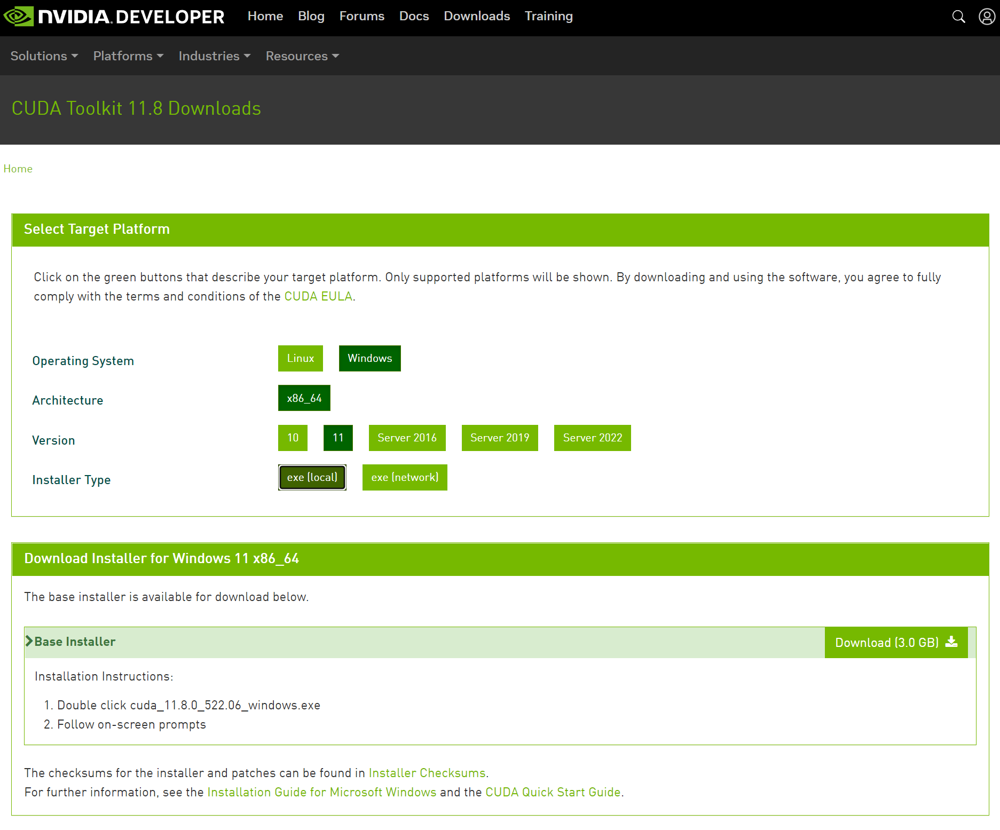
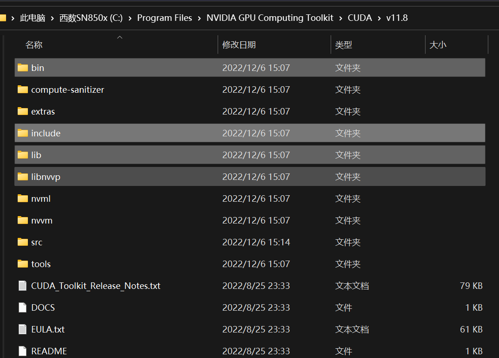
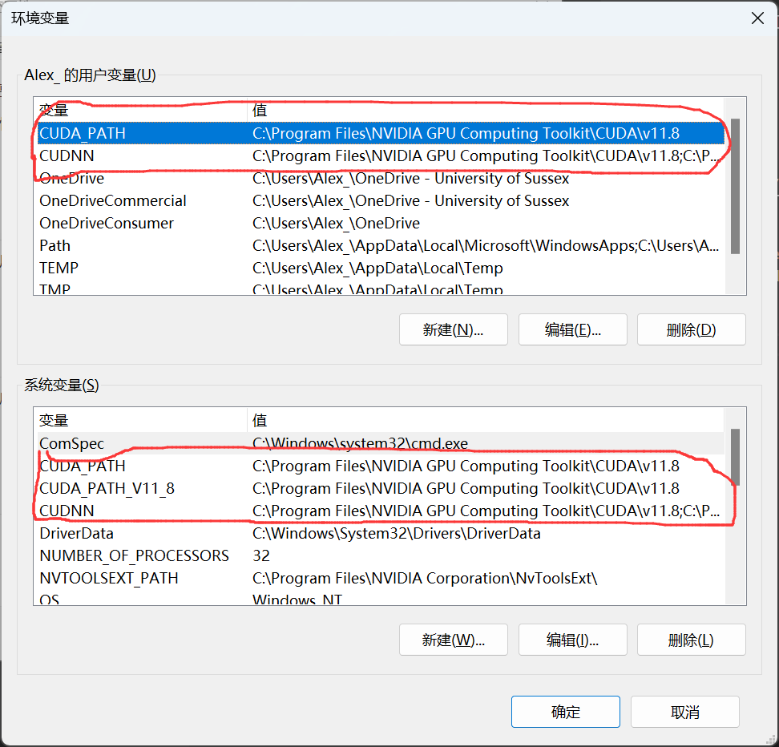

# Create your local GPU train environment on Windows 

# Install with conda

visit [pytorch](https://pytorch.org/get-started/locally/) website, running command they provided.
```
conda install pytorch torchvision torchaudio pytorch-cuda=11.7 -c pytorch -c nvidia
```

# Install manually
---
## 1.Install CUDA and CUDNN for windows

### 1.1 Download and install cuda toolkit

Visit [this website page](https://developer.nvidia.com/cuda-downloads) to download the latest CUDA toolkit.

You can also download pervious from the [Archive of Previous CUDA Releases](https://developer.nvidia.com/cuda-toolkit-archive) under the Resources section on the same page given above.

### 1.2 Download and setup CUDNN

Visit [this website page](https://developer.nvidia.com/rdp/cudnn-download) to download the latest CUDNN toolkit.

Text, extract the CUDNN files, then copy the contents of the cuda folder inside the cuDNN folder to the path where we installed CUDA in step 1 above. (We need the contents of the bin, include & lib folders from cuDNN to be inside the bin, include and lib folders of the CUDA directory)



### 1.3 Set environment varialbe

* C:\Program Files\NVIDIA GPU Computing Toolkit\CUDA\v11.8;
* C:\Program Files\NVIDIA GPU Computing Toolkit\CUDA\v11.8\bin;
* C:\Program Files\NVIDIA GPU Computing Toolkit\CUDA\v11.8\include;
* C:\Program Files\NVIDIA GPU Computing Toolkit\CUDA\v11.8\lib;

NOTE: Make sure to add these paths to both the CUDNN and Path System variables.

## 2. Install Deep Learning frameworks (Pytorch \ Tensorflow)

visit pytorch or tensorflow websit, follow the command they provided.
recommend use anaconda environment.


